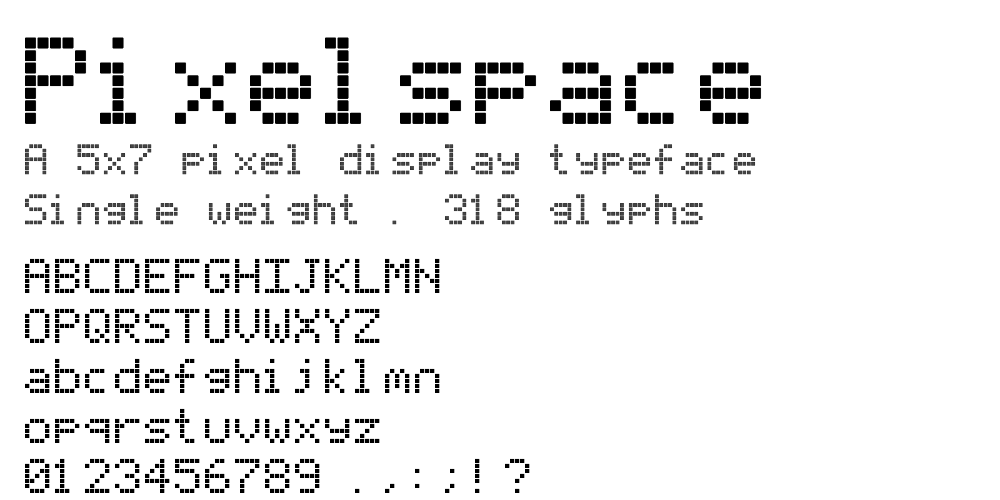

# Pixelspace

[](https://pixelspace.anirudha.dev)
[](OFL.txt)
[](FONTLOG.txt)
[](FONTLOG.txt)
[](fonts/)
[](https://pixelspace.anirudha.dev)
[](https://github.com/anistark/pixelspace)

An original 5×7 pixel display typeface by [Kumar Anirudha](https://github.com/anistark).
Single weight (Regular), **474 glyphs** — the full Google Fonts
Latin-core set (A–Z, a–z, 0–9, ASCII punctuation, Latin-1 Supplement,
Latin Extended-A/B, smart quotes, currency, combining diacritics) plus
**Unicode Box Drawing** (U+2500–257F) and **Block Elements**
(U+2580–259F) for terminal/TUI use. The new glyphs share the signature
gappy-pixel aesthetic — TUI borders read as stitched lines, btop bars
as LEGO towers — so terminal output stays unmistakably Pixelspace.
Licensed under the SIL Open Font License 1.1 — free to use in personal
and commercial work, free to modify, free to redistribute.


## Install

Grab a release and double-click the font file:

- macOS / Linux: `fonts/Pixelspace-Regular.ttf` → Font Book / your font manager
- Windows: right-click the `.ttf` → Install

In CSS:

```css
@font-face {
  font-family: "Pixelspace";
  src: url("fonts/Pixelspace-Regular.woff2") format("woff2"),
       url("fonts/Pixelspace-Regular.ttf")   format("truetype");
  font-weight: 400;
  font-style: normal;
  font-display: swap;
}

.pixel { font-family: "Pixelspace", monospace; }
```

Pixelspace is monospace — every glyph advances the same 6 pixels — so
disable ligatures and kerning for the crispest look.

## Design

- **Grid:** 5 columns × 7 rows per glyph, plus one built-in column of
  right-side bearing.
- **Metrics:** UPEM 875, pixel = 125 units, advance = 750, ascent = 625,
  descent = 250. Baseline sits between row 4 and row 5; rows 5–6 form
  the descender zone for `g j p q y` (and the like).
- **Shape primitive:** every "on" pixel renders as a 110×110-unit rounded
  square (≈10% corner radius) inset at the top-left of its 125-unit cell,
  so adjacent pixels leave a 15-unit gap on every side — the airy look
  of the design tool, baked straight into the outlines.
- **Pixel integrity:** no anti-aliasing, no hinting tricks. Set the font
  at multiples of 7 CSS pixels (14px, 21px, 28px, …, 105px, 175px) and
  every glyph-pixel lands on a whole device pixel.



## Building from source

Requires Python 3.12+ and [`just`](https://github.com/casey/just).

```sh
just setup    # creates .venv and installs fonttools, brotli, pillow, fontbakery
just build    # parses sources/glyphs.txt → fonts/*.{ttf,otf,woff2} + docs/
```

The build script reads `sources/glyphs.txt` (the canonical bitmap
source — see below), draws each "on" pixel as a 110×110-unit rounded
square, and writes `.ttf`, `.otf`, and `.woff2` to `fonts/`. It also
stages the `.ttf` and `.woff2` into `docs/` so the GitHub Pages site is
self-contained. `sources/Pixelspace.svg` is preserved as a versioned
artifact, regenerated from `glyphs.txt` by `tools/bitmap_to_svg.py`.

## Tweaking a glyph

Open `sources/glyphs.txt` and edit the 7-row × 5-column bitmap for any
character. `.` is an off pixel, `#` is on. Re-run `just build` and the
new glyph is in your TTF/OTF/WOFF2.

```text
@glyph uni0041
unicode: U+0041
.###.
#...#
#...#
#####
#...#
#...#
#...#
```

The top five rows sit above the baseline (cap area), the bottom two
below (descender zone for `g j p q y`). Format is documented in
`tools/parse_bitmap.py`.

## License

Pixelspace is licensed under the **SIL Open Font License, Version 1.1**.
See [OFL.txt](OFL.txt). "Pixelspace" is a Reserved Font Name — if you fork
and modify the fonts, please pick a different primary family name.

Copyright © 2026 Kumar Anirudha · <https://github.com/anistark/pixelspace>
